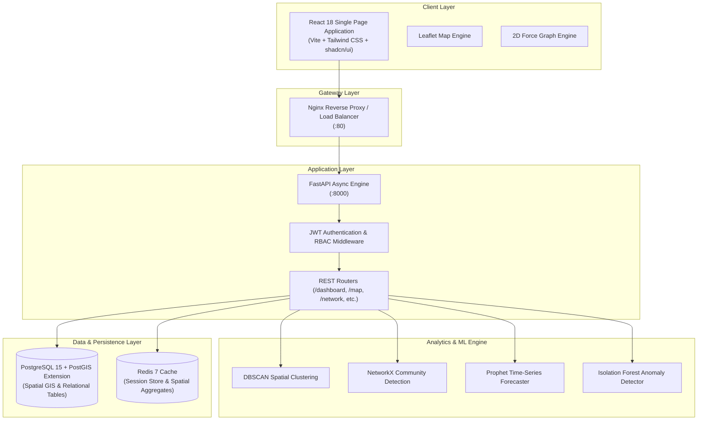
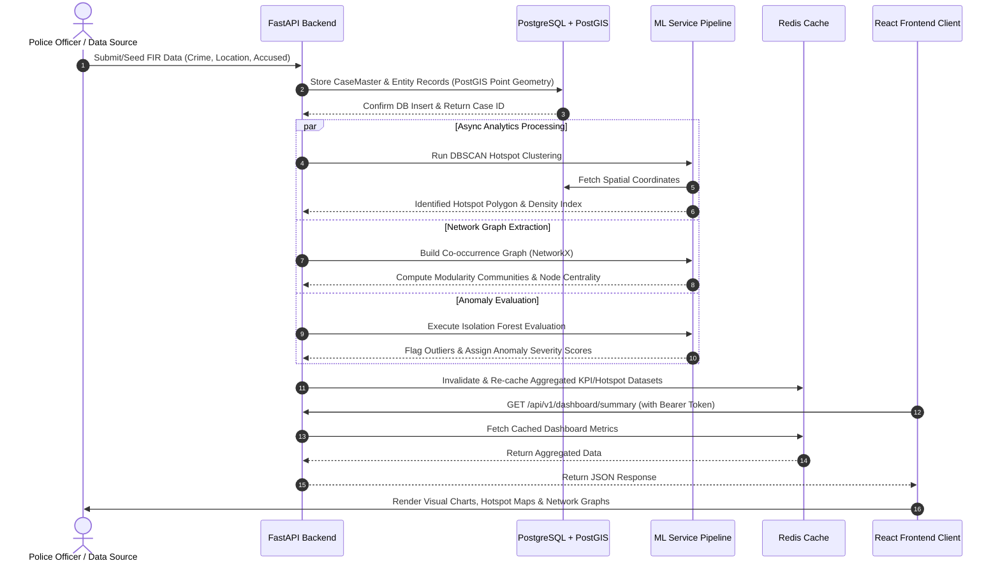
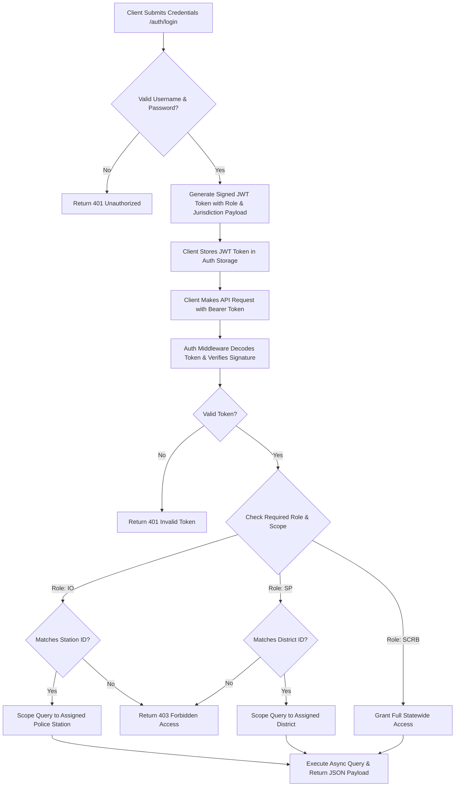
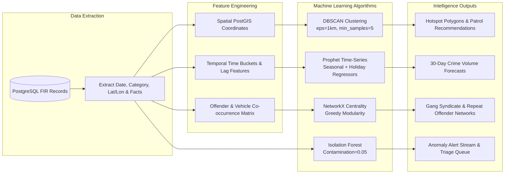

# 🛡️ AI Crime Intelligence & Predictive Analytics Platform

> **Strategic AI-Powered Crime Intelligence Hub for Karnataka State Police (KSP)**  
> Developed for the Economic Times Hackathon — Transforming siloed crime data into proactive, real-time spatial intelligence, criminal network discovery, and automated threat forecasting.

---

[](https://fastapi.tiangolo.com/)
[](https://react.dev/)
[](https://www.typescriptlang.org/)
[](https://www.postgresql.org/)
[](https://redis.io/)
[](https://tailwindcss.com/)
[](https://www.docker.com/)

---

## 📋 Table of Contents

- [Overview & Problem Statement](#-overview--problem-statement)
- [Key Capabilities](#-key-capabilities)
- [System Architecture](#-system-architecture)
- [Process Flows & Data Pipelines](#-process-flows--data-pipelines)
  - [1. Data Ingestion & Analytics Pipeline](#1-data-ingestion--analytics-pipeline)
  - [2. User Authentication & RBAC Authorization Flow](#2-user-authentication--rbac-authorization-flow)
  - [3. Predictive ML & Hotspot Detection Engine](#3-predictive-ml--hotspot-detection-engine)
- [Technology Stack](#-technology-stack)
- [Project Structure](#-project-structure)
- [Prerequisites](#-prerequisites)
- [Getting Started & Local Setup](#-getting-started--local-setup)
  - [Option A: Docker Compose (Recommended)](#option-a-docker-compose-recommended)
  - [Option B: Manual Local Setup](#option-b-manual-local-setup)
- [Database Schema & Data Model](#-database-schema--data-model)
- [API Endpoints Reference](#-api-endpoints-reference)
- [Security & Role-Based Access Control (RBAC)](#-security--role-based-access-control-rbac)
- [Machine Learning & Algorithmic Models](#-machine-learning--algorithmic-models)
- [License & Acknowledgments](#-license--acknowledgments)

---

## 🎯 Overview & Problem Statement

Law enforcement agencies historically rely on reactive reporting and static Excel-based FIR (First Information Report) logs. This fragmented approach leads to hidden crime syndicates, undetected spatial hotzones, and slow emergency responses across district boundaries.

The **AI Crime Intelligence & Predictive Analytics Platform** bridges this gap by unifying raw FIR databases into a high-performance **Strategic Intelligence Hub**. Powered by geospatial clustering (DBSCAN), social network graphs (NetworkX), and time-series forecasting (Prophet), the platform equips decision-makers—from State HQ (SCRB) to district Superintendents (SP) and station Investigating Officers (IO)—with actionable real-time situational awareness.

---

## ✨ Key Capabilities

- **📊 SCRB Executive Intelligence Dashboard**  
  Real-time KPI aggregation, MoM/YoY crime variance tracking, 6-month historical trend analysis, top crime category breakdowns, and color-coded alert streams.

- **🗺️ Interactive Geospatial Crime Mapping**  
  High-resolution spatial analytics powered by PostGIS. Supports density choropleths, spatial DBSCAN hotspot clustering, hourly time sliders (00:00–23:59), layer toggles, and automated patrol route recommendation algorithms.

- **🕸️ Criminal Network & Link Analysis**  
  Interactive 2D force-directed graph visualizing relationships between accused, victims, locations, and cases. Utilizes NetworkX for community detection (greedy modularity) and centrality metrics to unmask repeat offenders and gang syndicates.

- **📈 Crime Forecasting & Risk Heatmaps**  
  Multi-factor predictive scoring engine combining time-series forecasting with historical incident density, seasonal trends, and socio-economic correlation metrics (unemployment, literacy, urbanization).

- **🚨 Isolation Forest Anomaly Detection**  
  Automated ML pipeline detecting statistical outliers (e.g., sudden spikes in property crime or rare offenses in low-crime zones) with built-in triage and officer review workflows.

- **🔒 Multi-Tenant Role-Based Access Control (RBAC)**  
  Jurisdictional security model guaranteeing state-level vision for SCRB officers while scoping SP and IO access strictly to their assigned districts or police stations.

- **📄 Automated Intelligence Report Builder**  
  Export-ready PDF and Excel intelligence dossiers formatted for SCRB review, court evidence submission, and executive briefings.

---

## 🏗️ System Architecture

The platform architecture follows a modern, decoupled micro-services pattern designed for containerized deployment, low latency, and horizontal scalability.



### Infrastructure Component Breakdown

| Layer | Component | Functionality |
| :--- | :--- | :--- |
| **Reverse Proxy** | Nginx | Port 80 routing, TLS termination, static asset caching, and Gzip compression. |
| **Frontend** | React 18 + Vite | Modern dashboard client utilizing Zustand for global state, Recharts for analytics, Leaflet for maps, and Force-Graph for network exploration. |
| **API Server** | FastAPI (Python 3.11+) | Async ASGI backend delivering REST API routes, JWT security validation, and Pydantic v2 data serialization. |
| **ML Services** | scikit-learn / NetworkX / Prophet | Background and execution pipelines for spatial clustering, offender centrality analysis, time-series forecasting, and anomaly scoring. |
| **Primary Database** | PostgreSQL 15 + PostGIS | Relational data persistence with PostGIS spatial geometry indexing (`GEOMETRY(POINT, 4326)`). |
| **Cache Layer** | Redis 7 | In-memory query caching for heavy analytical aggregations and session token verification. |

---

## 🔄 Process Flows & Data Pipelines

### 1. Data Ingestion & Analytics Pipeline

The diagram below illustrates how raw FIR records enter the system, get processed through spatial and analytical pipelines, and are rendered on the user dashboard.



---

### 2. User Authentication & RBAC Authorization Flow

Security controls restrict spatial queries and data visibility based on user roles (`SCRB`, `SP`, `IO`).



---

### 3. Predictive ML & Hotspot Detection Engine



---

## 🛠️ Technology Stack

| Layer | Technology | Details / Purpose |
| :--- | :--- | :--- |
| **Frontend Core** | **React 18** + **TypeScript** | Built with **Vite** for fast HMR and optimized production bundles. |
| **State Management** | **Zustand** | Lightweight, reactive state management store. |
| **UI Components** | **shadcn/ui** + **Tailwind CSS** | Premium glassmorphism design, dark/light themes, Lucide icons. |
| **Data Visualizations** | **Recharts** | Smooth area charts, bar charts, composed forecasts, and scatter plots. |
| **Mapping Engine** | **React-Leaflet** + **Leaflet** | Interactive maps with OpenStreetMap / CARTO Dark tiles, GeoJSON overlays. |
| **Graph Network** | **React-Force-Graph-2D** | Animated 2D physics canvas graph for criminal network analysis. |
| **Backend Framework** | **Python FastAPI** | High-performance async ASGI Python framework with automatic Swagger docs. |
| **ORM & Migrations** | **SQLAlchemy 2.0** + **Alembic** | Async database access layer with DB migration management. |
| **Data Processing** | **Pandas** + **NumPy** | Dataframe manipulation, time-series binning, matrix ops. |
| **Machine Learning** | **scikit-learn** + **NetworkX** + **Prophet** | DBSCAN, Isolation Forest, Graph centrality, Meta Prophet forecasting. |
| **Database** | **PostgreSQL 15** + **PostGIS** | Enterprise spatial database supporting GIS geometry calculations. |
| **Caching Layer** | **Redis 7** | High-speed cache for spatial queries and session state. |
| **Containerization** | **Docker** + **Docker Compose** | Multi-container setup orchestrating Nginx, FastAPI, Postgres, Redis. |

---

## 📁 Project Structure

```
ai-crime-intelligence-platform/
├── docker-compose.yml           # Multi-container orchestration (Backend, Frontend, Postgres, Redis, Nginx)
├── README.md                    # System Documentation
├── masterprompt.md              # Functional specifications & roadmap
├── .env.example                 # Environment configuration template
├── nginx/
│   └── nginx.conf               # Nginx reverse proxy configuration
├── backend/
│   ├── Dockerfile
│   ├── requirements.txt         # Python dependencies
│   ├── alembic.ini              # Database migration configuration
│   ├── app/
│   │   ├── main.py              # FastAPI application entry point & CORS
│   │   ├── config.py            # Pydantic environment configuration
│   │   ├── database.py          # SQLAlchemy async session manager
│   │   ├── redis_client.py      # Redis pool initializer
│   │   ├── auth/                # JWT Utilities, Passwords, RBAC Dependencies
│   │   ├── models/              # SQLAlchemy 2.0 DB Models (CaseMaster, Person, Geography, Analytics, Users)
│   │   ├── schemas/             # Pydantic v2 Request/Response validation schemas
│   │   ├── routers/             # FastAPI REST Endpoints (/dashboard, /map, /network, /predictions, /anomalies, /reports)
│   │   ├── services/            # Business logic, SQL queries, ML service orchestrators
│   │   │   └── ml/              # DBSCAN, Isolation Forest, Prophet & NetworkX algorithms
│   │   ├── seeders/             # Karnataka police database mock data generator (8,000+ FIR records)
│   │   └── utils/               # Cache helpers & utility functions
│   └── alembic/                 # Alembic migration scripts
└── frontend/
    ├── Dockerfile
    ├── package.json             # NPM dependencies & scripts
    ├── vite.config.ts           # Vite build configuration
    ├── tailwind.config.js       # Tailwind CSS theme styling setup
    └── src/
        ├── App.tsx              # Main routing component with ProtectedRoute wrappers
        ├── main.tsx             # DOM initialization
        ├── components/          # Reusable UI, Dashboard, Map, Network & Report components
        ├── pages/               # Page views (Dashboard, MapView, Network, Predictions, Anomalies, Reports, Login)
        ├── hooks/               # Custom React hooks for API data fetching
        ├── lib/                 # Axios API client setup & constants
        ├── store/               # Zustand global state manager
        └── types/               # TypeScript interfaces & types
```

---

## ⚡ Prerequisites

Before setting up the project locally, ensure you have the following installed:

- **Docker Desktop** (v24.0+) and **Docker Compose** (v2.20+) — *Recommended*
- **Node.js** (v18.0+) & **npm** (v9.0+) — *For manual frontend execution*
- **Python** (v3.11+) & **pip** — *For manual backend execution*
- **PostgreSQL 15** with **PostGIS** extension — *For manual database execution*
- **Redis Server** (v7.0+) — *For caching support*

---

## 🚀 Getting Started & Local Setup

### Option A: Docker Compose (Recommended)

The fastest way to spin up the full stack including database, cache, backend, frontend, and reverse proxy:

```bash
# 1. Clone the repository
git clone https://github.com/your-org/ai-crime-intelligence-platform.git
cd ai-crime-intelligence-platform

# 2. Copy the environment file
cp .env.example .env

# 3. Build and launch all services in detached mode
docker compose up --build -d

# 4. Monitor startup logs
docker compose logs -f
```

Once running, access the services:
- 🌐 **Web Application**: [http://localhost](http://localhost) (or [http://localhost:5173](http://localhost:5173))
- ⚡ **Interactive API Docs (Swagger)**: [http://localhost:8000/docs](http://localhost:8000/docs)
- 📊 **ReDoc API Documentation**: [http://localhost:8000/redoc](http://localhost:8000/redoc)

---

### Option B: Manual Local Setup

#### Step 1: Database & Redis Setup

Start PostgreSQL (with PostGIS) and Redis using Docker:

```bash
docker run --name crime-postgres -e POSTGRES_DB=crime_db -e POSTGRES_USER=postgres -e POSTGRES_PASSWORD=postgres -p 5432:5432 -d postgis/postgis:15-3.3
docker run --name crime-redis -p 6379:6379 -d redis:7-alpine
```

#### Step 2: Backend Setup

```bash
cd backend

# Create virtual environment
python -m venv .venv
# On Windows:
.venv\Scripts\activate
# On Linux/macOS:
source .venv/bin/activate

# Install Python dependencies
pip install -r requirements.txt

# Run database migrations
alembic upgrade head

# Seed initial mock Karnataka police data (8,000+ records)
python -c "from app.seeders.data_seeder import DataSeeder; DataSeeder().seed_all()"

# Start FastAPI development server
uvicorn app.main:app --reload --port 8000
```

#### Step 3: Frontend Setup

```bash
cd frontend

# Install Node dependencies
npm install

# Start Vite development server
npm run dev
```

Visit `http://localhost:5173` to access the application interface.

---

## 🔑 Demo Login Credentials

The database seeder automatically initializes pre-configured accounts representing each RBAC tier:

| Role | Username | Password | Access Scope | Jurisdiction |
| :--- | :--- | :--- | :--- | :--- |
| **SCRB Officer** | `scrb_admin` | `password123` | **Statewide Access** | All Karnataka Districts |
| **Superintendent (SP)** | `sp_bangalore` | `password123` | **District Access** | Bangalore Urban District |
| **Investigating Officer (IO)** | `io_koramangala` | `password123` | **Station Access** | Koramangala Police Station |

---

## 🗄️ Database Schema & Data Model

The platform implements an extended relational FIR schema mapped from the **Karnataka State Police ER Framework**.

```
                       ┌───────────────────────┐
                       │      districts        │
                       └───────────┬───────────┘
                                   │ 1
                                   │
                                   │ N
                       ┌───────────┴───────────┐
                       │         units         │ (Police Stations)
                       └───────────┬───────────┘
                                   │ 1
                                   │
                                   │ N
┌──────────────────┐   ┌───────────┴───────────┐   ┌──────────────────┐
│   complainants   ├───┤      case_masters     ├───┤     accused      │
└──────────────────┘ N │  (FIR Central Table)  │ N └──────────────────┘
                       └───────────┬───────────┘
                                   │ 1
                                   │
                                   │ N
                       ┌───────────┴───────────┐
                       │  act_section_assoc    │
                       └───────────────────────┘
```

### Core Schema Highlights:
- **`case_masters`**: Primary FIR table containing `crime_no`, `crime_registered_date`, `incident_from_date`, `brief_facts`, `latitude`, `longitude`, and PostGIS `geom` geometry point.
- **`accused` / `complainants` / `victims`**: Demographic profiles, age, occupation, caste, religion, and crime involvement linkage.
- **`act_sections`**: Statutory law mapping (IPC / Special Acts).
- **`analytics` Tables**: Persistent cache storage for `crime_hotspots`, `risk_predictions`, `anomaly_detections`, and `mo_patterns`.
- **`users`**: System security accounts with hashed passwords and RBAC scope foreign keys (`district_id`, `station_id`).

---

## 🔌 API Endpoints Reference

### 🔐 Authentication Router (`/api/v1/auth`)

| Method | Endpoint | Description | Access |
| :--- | :--- | :--- | :--- |
| `POST` | `/auth/login` | Authenticate user credentials & receive OAuth2 JWT bearer token. | Public |
| `POST` | `/auth/register` | Register a new police administrative or field user. | SCRB Admin |
| `GET` | `/auth/me` | Fetch authenticated user profile and assigned scope. | Authenticated |

### 📊 Strategic Dashboard Router (`/api/v1/dashboard`)

| Method | Endpoint | Description | Access |
| :--- | :--- | :--- | :--- |
| `GET` | `/dashboard/summary` | Aggregate KPIs: total FIRs, today's cases, hotspots, and YoY/MoM trends. | Authenticated |
| `GET` | `/dashboard/trends` | Historical daily crime counts grouped by major crime heads. | Authenticated |
| `GET` | `/dashboard/categories` | Percentage breakdown of top 5 crime categories. | Authenticated |
| `GET` | `/dashboard/alerts` | Real-time system alert feed prioritized by severity. | Authenticated |
| `GET` | `/dashboard/recent-cases` | Paginated summary list of newly registered FIR cases. | Authenticated |

### 🗺️ GIS Mapping & Hotspot Router (`/api/v1/map`)

| Method | Endpoint | Description | Access |
| :--- | :--- | :--- | :--- |
| `GET` | `/map/districts` | Statewide district boundaries with density statistics. | Authenticated |
| `GET` | `/map/hotspots` | Spatial DBSCAN clustering results with radius and intensity index. | Authenticated |
| `GET` | `/map/cases` | Spatial bounding box filter query (`ST_Within`) for pins. | Authenticated |
| `GET` | `/map/temporal-pattern` | Hourly and weekly crime distribution arrays for time-slider filtering. | Authenticated |

### 🕸️ Criminal Network Router (`/api/v1/network`)

| Method | Endpoint | Description | Access |
| :--- | :--- | :--- | :--- |
| `GET` | `/network/accused/{id}` | N-depth graph nodes and edges for an offender network. | Authenticated |
| `GET` | `/network/communities` | Detected criminal communities based on modularity graph algorithms. | Authenticated |
| `GET` | `/network/repeat-offenders` | Filtered list of repeat offenders linked across multiple cases/districts. | Authenticated |

### 📈 Forecasting & Anomalies Router (`/api/v1/predictions` & `/api/v1/anomalies`)

| Method | Endpoint | Description | Access |
| :--- | :--- | :--- | :--- |
| `GET` | `/predictions/forecast` | Prophet 30-day time-series predictions with confidence interval bands. | Authenticated |
| `GET` | `/predictions/risk-scores` | Per-district risk indices computed from multi-factor threat metrics. | Authenticated |
| `GET` | `/anomalies` | Isolation Forest anomaly detections table with severity tags. | Authenticated |
| `POST` | `/anomalies/{id}/review` | Triage an anomaly detection alert with reviewer notes. | SP / SCRB |

---

## 🧠 Machine Learning & Algorithmic Models

### 1. DBSCAN Spatial Hotspot Clustering
- **Purpose**: Groups geographically dense crime incidents without requiring predefined cluster counts.
- **Parameters**: `eps = 0.01` (~1km coordinate distance), `min_samples = 5`.
- **Output**: Identifies high-density hotzones (e.g., Koramangala theft cluster) and extracts centroid, radius, and risk severity.

### 2. Prophet Crime Forecasting
- **Purpose**: Predicts future crime volume patterns based on historical temporal patterns.
- **Features**: Weekly and yearly seasonality, holiday regressors, and 95% uncertainty interval bands (`yhat_lower`, `yhat_upper`).

### 3. NetworkX Community & Co-Occurrence Graph
- **Purpose**: Discovers hidden criminal syndicates sharing common accused individuals, modus operandi, phone numbers, or getaway vehicles.
- **Algorithm**: `greedy_modularity_communities` to partition network graphs into discrete gang clusters.

### 4. Isolation Forest Anomaly Detection
- **Purpose**: Identifies statistical outliers in crime logs (e.g., unexpected murder spikes in peaceful rural sectors or unusual crime hour distribution).
- **Parameters**: `contamination = 0.05`. Outputs an anomaly score from `-1.0` (severe outlier) to `1.0` (normal pattern).

---

## 🛡️ Security & Hardening

- **JWT Authentication**: Encrypted RSA/HMAC tokens with configurable token expiration (`ACCESS_TOKEN_EXPIRE_MINUTES`).
- **Password Protection**: Passlib `bcrypt` hashing with salt verification.
- **Input Sanitization**: Pydantic v2 strict data validation preventing injection attacks.
- **Database Security**: Prepared SQL statements executed via SQLAlchemy 2.0 async engine preventing SQL injection.
- **Cross-Origin Resource Sharing (CORS)**: Configured header protection in FastAPI middleware.

---

## 📜 License & Acknowledgments

This project is released under the **MIT License**.

Designed and built for the **Economic Times Hackathon** in collaboration with technical frameworks inspired by the **Karnataka State Police (KSP) Strategic Intelligence Mandate**.

---

<p center="align">
  <b>Strategic Crime Intelligence Hub</b> • Empowering Law Enforcement with Predictive AI Intelligence
</p>
